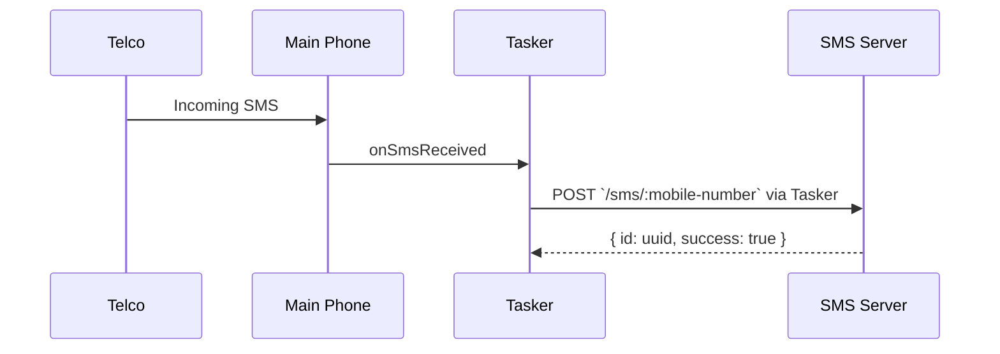
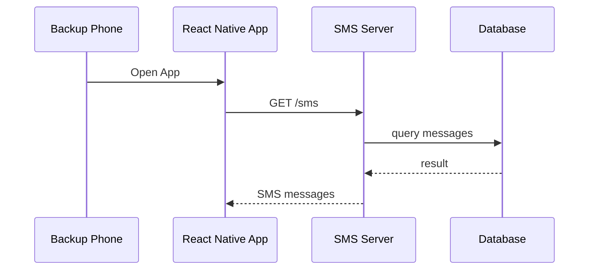
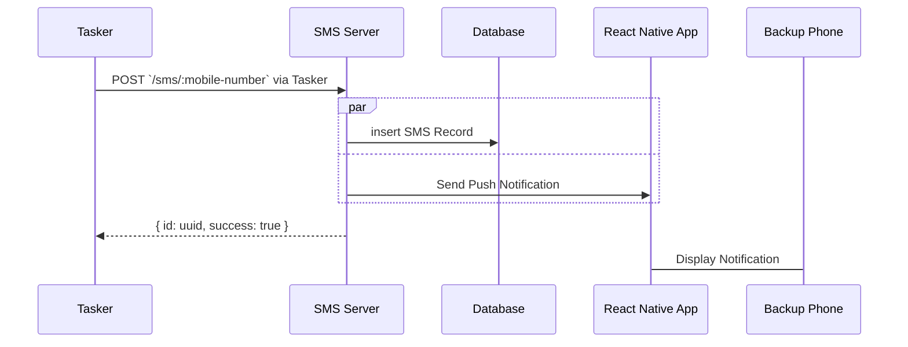
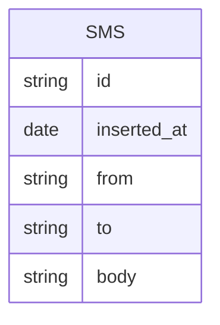

# SMS Center

This server will store my personal sms messages in a lightweight sqlite database

## Motivation
I'm paranoid of losing my main phone with my only number where a lot of my main accounts are linked. This phone contains social media apps, banking apps, and other productivity apps that I use on a day to day basis.

## Components
- **Main Phone**
  - will delegate incoming SMS messages using Tasker and `curl` command to the server
- **Backup Phone**
  - will have a dedicated React Native app to view messages from the server
- **Tasker App (Paid)**
  - Android app used for automation
- **React Native App**
  - Custom mobile app used to retrieve messages from the server as well as receive Push Notifications
- **SMS Server**
  - A basic linode instance running on the cheapest plan of $5 per month

## Use Cases
- Store incoming SMS messages from Main Phone via `POST` endpoint
- Retrieve SMS messages from Backup Phone React Native App via `GET` endpoint
- Retrieve real-time database copy using `syncthing`

## Diagram

Main Phone Message Sync


Backup Phone Message Retrieval


Push Notification


## Endpoints

Retrieve all SMS messages
```
GET /sms
```

Retrieve SMS messages of a number
```
GET /sms/:mobile-number
```

Retrieve SMS messaage of a specific number
```
GET /sms/:mobile-number/:id
```

Insert SMS Record
```
POST /sms/:mobile-number
```

## Class Diagram


