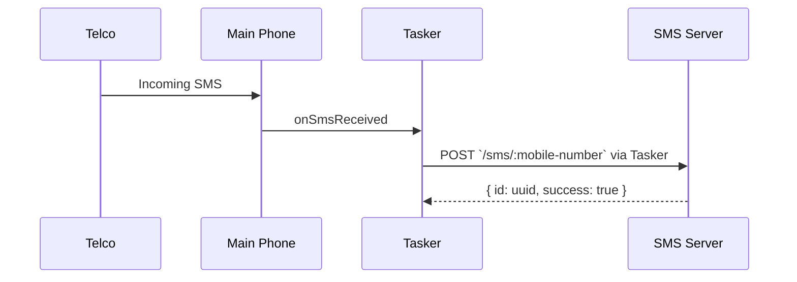
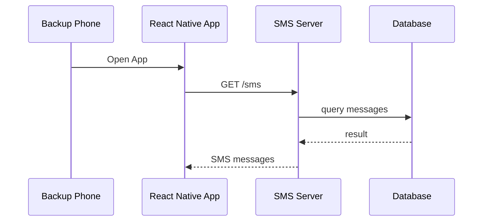
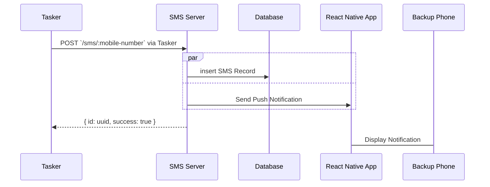
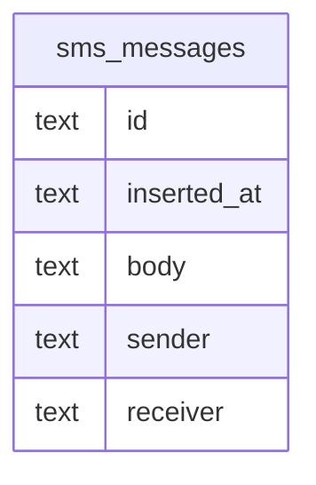

# SMS Center

This server will store my personal sms messages in a lightweight sqlite database

## Motivation
I'm paranoid of losing my main phone with my only number where a lot of my main accounts are linked. This phone contains social media apps, banking apps, and other productivity apps that I use on a day to day basis.

## Security Warning
The code is mostly complete now. I'm just giving a heads up for anyone wanting to deploy this for personal use:

By practice it is HIGHLY recommended to have an authentication middleware implementation to secure the API endpoints.
Right now I'm excluding authentication from this codebase and I'm still contemplating if it's safe to open-source.

Just know that having more layers of security aside from a username and password helps a lot. Here are some ideas:
- JWT tokens that expire after a certain amount of time
- Device Ids
  - IMEI
  - GAID
  - IP Address
  - Fingerprint
- A unique keyphrase as cherry on top

Please take time to read the [disclaimer](#disclaimer) below. Then read about using the basic [Authentication](#Authentication) below

## Components
- **Main Phone**
  - will delegate incoming SMS messages using Tasker and `curl` command to the server
- **Backup Phone**
  - will have a dedicated React Native app to view messages from the server
- **Tasker App (Paid)**
  - Android app used for automation
- **React Native App**
  - Custom mobile app used to retrieve messages from the server as well as receive Push Notifications
- **SMS Server**
  - A basic linode instance running on the cheapest plan of $5 per month

## Use Cases
- Store incoming SMS messages from Main Phone via `POST` endpoint
- Retrieve SMS messages from Backup Phone React Native App via `GET` endpoint
- Retrieve real-time database copy using `syncthing` for offline use

## Diagram

Main Phone Message Sync


Backup Phone Message Retrieval


Push Notification


## API

Responses will be in JSON and will semi-comply with [JSend](https://github.com/omniti-labs/jsend) REST API standard for simplicity.

### Success Response

`200 OK`

```json
{
    "status": "success",
    "data": {
        "sms": [
          {
             "id": "10b41abe-db8e-432f-bd01-2cb34652dfa3",
             "inserted_at": "2024-06-23t10:55:04z",
             "sender": "0916123456",
             "receiver": "09062088003",
             "body": "hello world"
          },
          {
             "id": "10b41eba-db8e-432f-bd01-2cb34652dda1",
             "inserted_at": "2024-06-23t10:55:04z",
             "sender": "0916123456",
             "receiver": "09062088003",
             "body": "hello again world"
          },
          {
             "id": "10b41eba-db8e-432f-bd01-2cb34652dda1",
             "inserted_at": "2024-06-23t10:55:04z",
             "sender": "0916123456",
             "receiver": "09062088003",
             "body": "sup world"
          }
        ]
    }
}

```
### Error Response

Internal server errors are to return `500` status codes

```json
{
    "status": "error",
    "message": "Unable to connect to database"
}
```

Retrieve all SMS messages
```
GET /sms
```

Retrieve SMS messages of a number
```
GET /sms/:sender
```

Retrieve SMS message of from sender
```
GET /sms/:sender/:id
```

Insert SMS Record
```
POST /sms/:sender
```

payload

```json
{
  "receiver": "0916123456",
  "body": "hello world"
}
```

response
```json
{
    "status": "success",
    "data": {
      "sms": {
         "id": "10b41abe-db8e-432f-bd01-2cb34652dfa3",
         "inserted_at": "2024-06-23t10:55:04z",
         "body": "hello world"
         "sender": "0916123456",
         "receiver": "09062088003"
      }
    }
}
```

## Class Diagram

Sqlite data types are simpler hence why everything is in `text`

Read more about the available types [here](https://www.sqlite.org/datatype3.html)



# Authentication

The sms server instance under `main.go` is currently wrapped in auth middleware as follows

```go
// main.go
smsServer := NewSmsServer(store)
authServer := NewAuthServer(smsServer)
fmt.Println(http.ListenAndServe(port, auth))
```

- Feel free to remove `authServer` or modify it in `authenticate.go` if needed
- Update your `.env` file to have an `AUTH_VALIDATE_URL` value. See the `.env.sample` file for more details

# Disclaimer
SMS Center (the "Server") is provided "as is", without warranty of any kind, express or implied, including but not limited to the warranties of merchantability, fitness for a particular purpose, and noninfringement. In no event shall the authors or copyright holders be liable for any claim, damages, or other liability, whether in an action of contract, tort, or otherwise, arising from, out of, or in connection with the Server or the use or other dealings in the Server.

The user assumes all responsibility and risk for the use of the Server. The authors and contributors are not responsible for any issues that may arise from the use or misuse of the Server, including but not limited to loss of data, financial loss, or damage to hardware or software.

The Server is provided with the hope that it will be useful for synchronizing SMS messages, but it is not guaranteed to be error-free or to meet any particular standards of performance, security, or quality. Users are encouraged to test the Server thoroughly before deploying it in a production environment.

The authors and contributors make no guarantees regarding the security of the messages synced by the Server and are not responsible for any unauthorized access to or interception of messages.

The authors and contributors reserve the right to make changes to the Server at any time without notice. Users are responsible for ensuring that they are using the most current version of the Server.

By using the Server, you agree to these terms and conditions.
