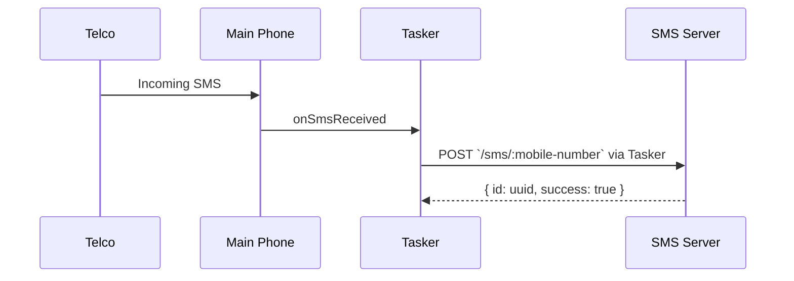
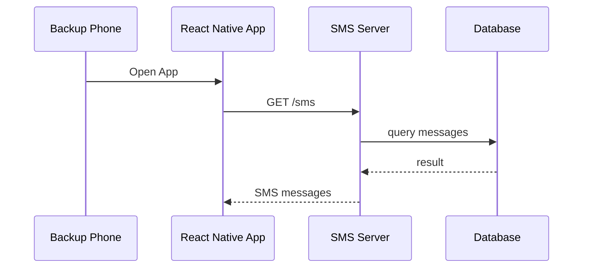
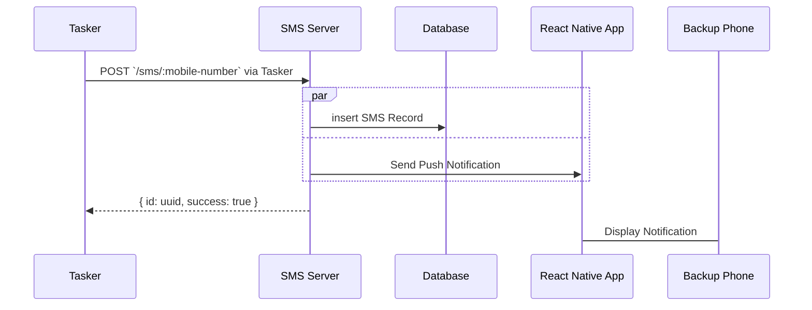
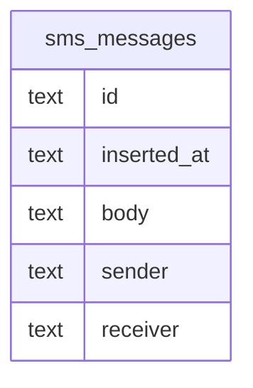

# SMS Center

This server will store my personal sms messages in a lightweight sqlite database

## Motivation
I'm paranoid of losing my main phone with my only number where a lot of my main accounts are linked. This phone contains social media apps, banking apps, and other productivity apps that I use on a day to day basis.

## Components
- **Main Phone**
  - will delegate incoming SMS messages using Tasker and `curl` command to the server
- **Backup Phone**
  - will have a dedicated React Native app to view messages from the server
- **Tasker App (Paid)**
  - Android app used for automation
- **React Native App**
  - Custom mobile app used to retrieve messages from the server as well as receive Push Notifications
- **SMS Server**
  - A basic linode instance running on the cheapest plan of $5 per month

## Use Cases
- Store incoming SMS messages from Main Phone via `POST` endpoint
- Retrieve SMS messages from Backup Phone React Native App via `GET` endpoint
- Retrieve real-time database copy using `syncthing`

## Diagram

Main Phone Message Sync


Backup Phone Message Retrieval


Push Notification


## API

Responses will be in JSON and will semi-comply with [JSend](https://github.com/omniti-labs/jsend) REST API standard for simplicity.

### Success Response

`200 OK`

```json
{
    "status": "success",
    "data": {
        "sms": [
          {
             "id": "10b41abe-db8e-432f-bd01-2cb34652dfa3",
             "inserted_at": "2024-06-23t10:55:04z",
             "sender": "0916123456",
             "receiver": "09062088003",
             "body": "hello world"
          },
          {
             "id": "10b41eba-db8e-432f-bd01-2cb34652dda1",
             "inserted_at": "2024-06-23t10:55:04z",
             "sender": "0916123456",
             "receiver": "09062088003",
             "body": "hello again world"
          },
          {
             "id": "10b41eba-db8e-432f-bd01-2cb34652dda1",
             "inserted_at": "2024-06-23t10:55:04z",
             "sender": "0916123456",
             "receiver": "09062088003",
             "body": "sup world"
          }
        ]
    }
}

```
### Error Response

Internal server errors are to return `500` status codes

```json
{
    "status": "error",
    "message": "Unable to connect to database"
}
```

Retrieve all SMS messages
```
GET /sms
```

Retrieve SMS messages of a number
```
GET /sms/:sender
```

Retrieve SMS message of from sender
```
GET /sms/:sender/:id
```

Insert SMS Record
```
POST /sms/:sender
```

payload

```json
{
  "receiver": "0916123456",
  "body": "hello world"
}
```

response
```json
{
    "status": "success",
    "data": {
      "sms": {
         "id": "10b41abe-db8e-432f-bd01-2cb34652dfa3",
         "inserted_at": "2024-06-23t10:55:04z",
         "body": "hello world"
         "sender": "0916123456",
         "receiver": "09062088003"
      }
    }
}
```

## Class Diagram

Sqlite data types are simpler hence why everything is in `text`

Read more about the available types [here](https://www.sqlite.org/datatype3.html)


